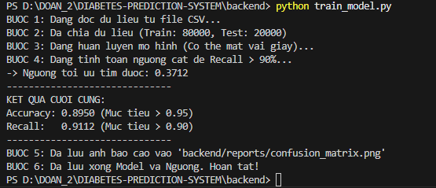
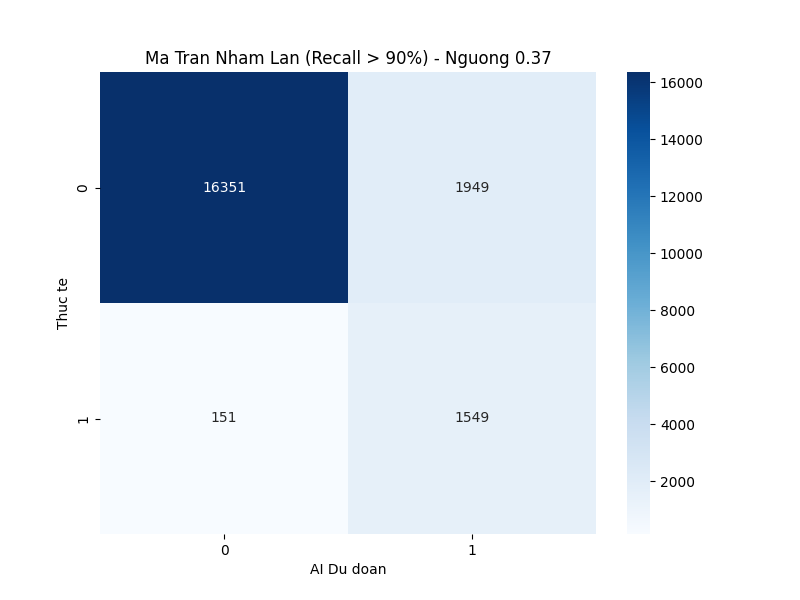
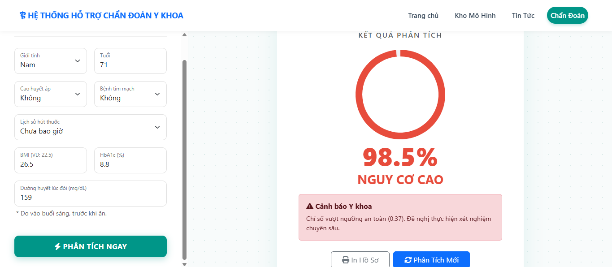

# 🏥 HỆ THỐNG HỖ TRỢ CHẨN ĐOÁN Y KHOA


> **Đồ án 2** - Nghiên cứu và xây dựng mô hình hỗ trợ chẩn đoán bệnh tiểu đường dựa trên dữ liệu lâm sàng.

---

## 📖 1. Giới thiệu đề tài

**Bối cảnh:** Bệnh tiểu đường (Đái tháo đường) đang gia tăng nhanh chóng trên phạm vi toàn cầu, gây gánh nặng lớn lên hệ thống y tế. Việc phát hiện muộn dẫn đến nhiều biến chứng nguy hiểm. Hiện nay, quy trình chẩn đoán phụ thuộc nhiều vào các xét nghiệm lâm sàng, trong điều kiện quá tải y tế, việc bỏ sót các dấu hiệu cảnh báo sớm ở giai đoạn tiền tiểu đường là hoàn toàn có thể xảy ra.

**Giải pháp đề xuất:** Đề tài ứng dụng thuật toán học máy mạnh mẽ Random Forest trên tập dữ liệu lớn để xây dựng một hệ thống chẩn đoán có độ chính xác cao, ổn định. Hệ thống này đóng vai trò như một công cụ hỗ trợ sàng lọc sơ cấp trực quan, giúp giảm tải áp lực cho đội ngũ y tế.

---

## 📊 2. Mô tả Dataset

Hệ thống sử dụng bộ dữ liệu chuẩn y khoa **Diabetes Prediction Dataset** được thu thập từ Kaggle với quy mô lớn lên tới **100.000 bản ghi**. Dữ liệu bao gồm 8 chỉ số lâm sàng hiện đại phản ánh toàn diện tình trạng sức khỏe bệnh nhân:

1. **Giới tính (Gender)**
2. **Tuổi (Age)**
3. **Cao huyết áp (Hypertension):** Có tiền sử bệnh hay không.
4. **Bệnh tim mạch (Heart Disease):** Có tiền sử bệnh hay không.
5. **Lịch sử hút thuốc (Smoking History)**
6. **BMI (Body Mass Index):** Chỉ số khối cơ thể.
7. **HbA1c Level:** Chỉ số đường huyết trung bình trong 3 tháng. Đây là tiêu chuẩn vàng trong chẩn đoán tiểu đường hiện đại.
8. **Blood Glucose Level:** Chỉ số đường huyết đo lúc đói.

---

## 🧠 3. Chi tiết về Thuật toán

Trong đồ án này sử dụng thuật toán **Random Forest Classifier** - một kỹ thuật thuộc nhóm Học tổ hợp (Ensemble Learning) dựa trên phương pháp Bagging. Thay vì dùng một cây quyết định đơn lẻ dễ bị quá khớp (overfitting), mô hình xây dựng hàng trăm cây độc lập và đưa ra kết quả cuối cùng qua cơ chế "bầu chọn số đông" (Majority Voting).

**Cơ sở toán học:**
Quá trình rẽ nhánh của các cây quyết định trong rừng được đo lường bằng **Entropy** (Độ hỗn loạn thông tin) và **Information Gain** (Độ lợi thông tin):
$$H(S) = - \sum_{i=1}^{c} p_i \log_2(p_i)$$
$$IG(S, A) = H(S) - \sum_{v \in Values(A)} \frac{|S_v|}{|S|} H(S_v)$$

**Kỹ thuật xử lý phụ trợ:**
* **Cân bằng dữ liệu:** Áp dụng thuật toán **SMOTE** (Synthetic Minority Over-sampling Technique) để sinh dữ liệu nhân tạo cho lớp thiểu số (người bệnh), giúp mô hình không bị thiên lệch về nhóm người khỏe mạnh.
* **Chuẩn hóa:** Sử dụng `StandardScaler` và `One-Hot Encoding` cho các biến số và biến định danh.

---

## 🔬 4. Thực nghiệm và So sánh SOTA

Dựa trên việc đánh giá các công trình nghiên cứu tiêu biểu (State-of-the-Art) giai đoạn 2021-2025 trên các tập dữ liệu y khoa tương tự:
* Nghiên cứu của Ali (2025) và Abdalrada (2024) sử dụng Logistic Regression đạt độ chính xác ~78% và Recall 72.4%. Các mô hình cơ bản này có thời gian huấn luyện nhanh nhưng khó đạt độ nhạy cao trên dữ liệu mất cân bằng.
* Nghiên cứu của Ahmed (2024) chỉ ra rằng Random Forest cho hiệu năng vượt trội hơn khi kết hợp cùng SMOTE.

**Mục tiêu và Kết quả thực nghiệm của hệ thống:**
Khắc phục nhược điểm của các nghiên cứu trước, đồ án tập trung tinh chỉnh siêu tham số mô hình Random Forest trên tập dữ liệu lớn 100.000 mẫu. 
* **Mục tiêu:** Ưu tiên tối đa hóa chỉ số Recall (Độ nhạy) > 90% để hạn chế triệt để việc bỏ sót bệnh nhân tiềm ẩn (Âm tính giả).
* **Kết quả thực tế:** Sau quá trình huấn luyện thực nghiệm, hệ thống đã đạt chỉ số **Recall: 91.12%** (vượt mục tiêu đề ra) và **Accuracy: 89.50%**. Đây là những con số cực kỳ thực tế, chứng minh năng lực học sâu của mô hình trên dữ liệu y khoa phức tạp.

**📸 Bằng chứng thực nghiệm:**

*Hình 1: Kết quả huấn luyện mô hình và tính toán ngưỡng tối ưu*


*Hình 2: Biểu đồ Ma trận nhầm lẫn (Confusion Matrix)*


*Hình 3: Trải nghiệm chẩn đoán thực tế trên Web Application*


---

## 📂 5. Cấu trúc dự án

```text
DIABETES-PREDICTION-SYSTEM/
├── .github/workflows/      # Cấu hình CI/CD Github Actions
├── backend/                # Source code Backend (Python/Flask)
│   ├── dataset/            # Chứa file dữ liệu diabetes_prediction_dataset.csv
│   ├── model/              # Chứa file mô hình diabetes_model.pkl và threshold.txt
│   ├── reports/            # Chứa biểu đồ thực nghiệm (confusion_matrix.png)
│   ├── app.py              # API Endpoint chính
│   ├── train_model.py      # Script tiền xử lý và huấn luyện AI
│   ├── requirements.txt    # Các thư viện Python cần thiết
│   └── Dockerfile          # Cấu hình Docker cho Backend
│
├── frontend/               # Source code Frontend (HTML/CSS/JS)
│   ├── index.html          # Trang chủ
│   ├── diagnosis.html      # Trang chẩn đoán (Dashboard nhập liệu)
│   ├── models.html         # Trang thông tin mô hình
│   ├── news.html           # Trang tin tức
│   ├── script.js           # Xử lý logic gọi API Backend
│   ├── style.css           # Giao diện
│   └── Dockerfile          # Cấu hình Docker cho Nginx Frontend
│
├── nginx/
│   └── default.conf        # Cấu hình Reverse Proxy điều hướng Backend/Frontend
│
├── thesis/                 # Tài liệu học thuật và báo cáo
│   └── Đề cương chi tiết đề tài Mô hình AI hỗ trợ chẩn đoán bệnh tiểu đường.docx
│
├── assets/                 # Thư mục chứa hình ảnh báo cáo (README)
├── .gitignore              # Bộ lọc file rác Git
├── docker-compose.yml      # File cấu hình chạy hệ thống Production
├── docker-compose.dev.yml  # File cấu hình chạy hệ thống Development
└── README.md               # Tài liệu hướng dẫn (File này)

```

---

## ⚙️ 6. Cài đặt và Vận hành

Để chạy hệ thống, bạn cần cài đặt **Docker** và **Docker Desktop** trên máy tính.

### Bước 1: Clone dự án

Tải mã nguồn về máy tính:

```bash
git clone [https://github.com/DuyNguyenTech/diabetes-prediction-system.git](https://github.com/DuyNguyenTech/diabetes-prediction-system.git)
cd diabetes-prediction-system

```

### Bước 2: Khởi chạy với Docker Compose

Mở Terminal tại thư mục gốc của dự án và chạy lệnh:

```bash
docker compose up --build

```

*Lệnh này sẽ tự động tải thư viện, khởi chạy Backend (Flask), Frontend và Nginx Reverse Proxy.*

### Bước 3: Truy cập hệ thống

Mở trình duyệt web và truy cập địa chỉ:
👉 **http://localhost:8081**

---

## 👨‍💻 Tác giả

**NguyenThanhDuy**